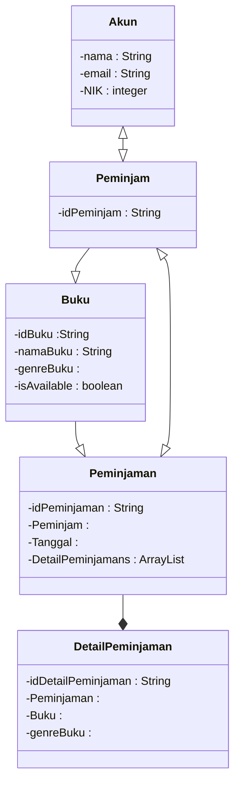

# UAS-DASPRO

```mermaid
classDiagram
    class Akun{
        -nama : String
        -email : String
        -NIK : integer
    }

    class Buku{
        -idBuku :String
        -namaBuku : String
        -genreBuku :
        -isAvailable : boolean
    }

    class DetailPeminjaman{
        -idDetailPeminjaman : String
        -Peminjaman :
        -Buku :
        -genreBuku :
     
    }

    class Peminjam{
        -idPeminjam : String
    }

class Peminjaman{
        -idPeminjaman : String
        -Peminjam :
        -Tanggal :
        -DetailPeminjamans : ArrayList

}

    Akun <|--|> Peminjam
    Buku --|> Peminjaman
    Peminjam --|> Buku
    Peminjaman <|--|> Peminjam
    Peminjaman --*  DetailPeminjaman
    
```
