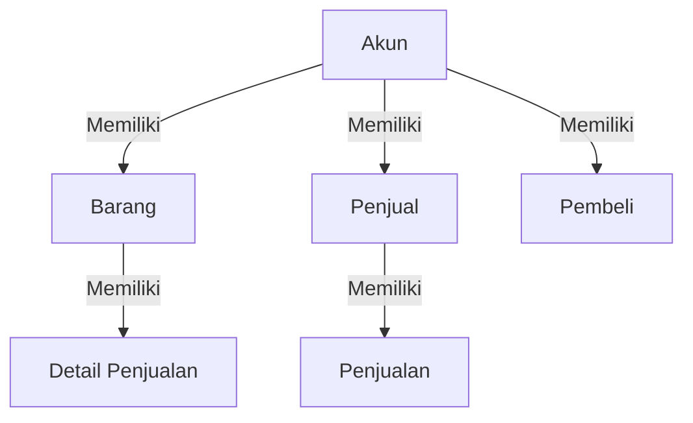
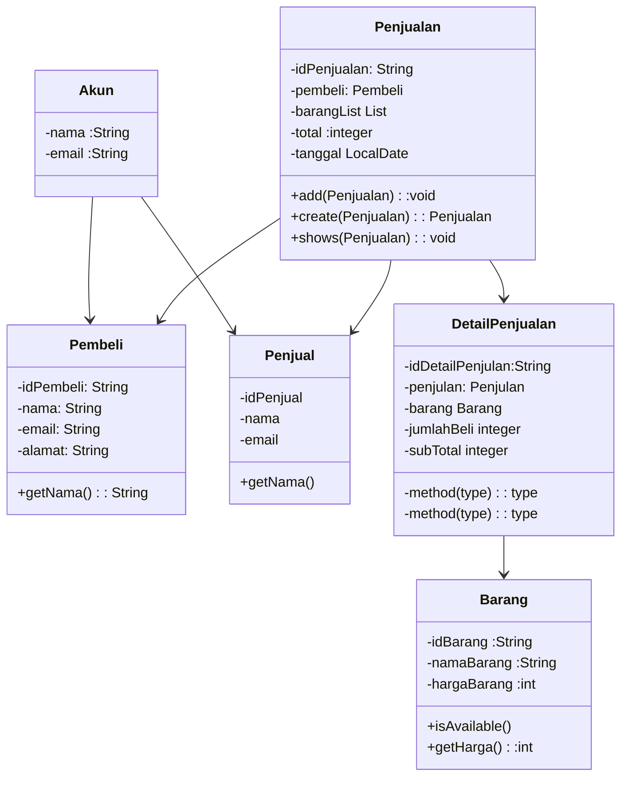

# UAS-DASPRO

```mermaid
graph TD
    A[Akun] -->|Memiliki| B[Barang];
    A -->|Memiliki| C[Penjual];
    A -->|Memiliki| D[Pembeli];
    B -->|Memiliki| E[Detail Penjualan];
    C -->|Memiliki| F[Penjualan];
```

```mermaid
classDiagram
    class Akun{
        -nama :String
        -email :String
    }
    class Barang{
        -idBarang :String
        -namaBarang :String
        -hargaBarang :int
        +isAvailable() 
        +getHarga():int
    }
    class Pembeli{
        -idPembeli: String 
        -nama: String 
        -email: String 
        -alamat: String 
        +getNama(): String
    }

    class Penjual{
        -idPenjual
        -nama
        -email
        +getNama()
    }
    class Penjualan{
        -idPenjualan: String 
        -pembeli: Pembeli 
        -barangList List<Barang>  
        -total :integer  
        -tanggal LocalDate  
        +add(Penjualan):void   
        +create(Penjualan): Penjualan   
        +shows(Penjualan): void   
    }
    class DetailPenjualan{
        -idDetailPenjulan:String   
        -penjulan: Penjulan   
        -barang Barang    
        -jumlahBeli integer    
        -subTotal integer    
        -method(type): type    
        -method(type): type
    }
    Akun --> Pembeli
    Akun --> Penjual

    DetailPenjualan --> Barang
    Penjualan --> DetailPenjualan
    Penjualan --> Pembeli
    Penjualan --> Penjual
```
