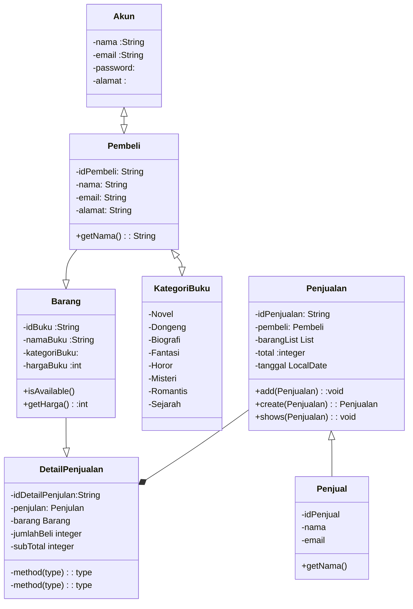

# UAS-DASPRO

```mermaid
classDiagram
    class Akun{
        -nama :String
        -email :String
        -password:
        -alamat :
    }

    class Barang{
        -idBuku :String
        -namaBuku :String
        -kategoriBuku:
        -hargaBuku :int
        +isAvailable() 
        +getHarga():int
    }

    class KategoriBuku{
        -Novel
        -Dongeng
        -Biografi
        -Fantasi
        -Horor
        -Misteri
        -Romantis
        -Sejarah
    }

    class Pembeli{
        -idPembeli: String 
        -nama: String 
        -email: String 
        -alamat: String 
        +getNama(): String
    }

    class Penjual{
        -idPenjual
        -nama
        -email
        +getNama()
    }

    class Penjualan{
        -idPenjualan: String 
        -pembeli: Pembeli 
        -barangList List<Barang>  
        -total :integer  
        -tanggal LocalDate  
        +add(Penjualan):void   
        +create(Penjualan): Penjualan   
        +shows(Penjualan): void   
    }

    class DetailPenjualan{
        -idDetailPenjulan:String   
        -penjulan: Penjulan   
        -barang Barang    
        -jumlahBeli integer    
        -subTotal integer    
        -method(type): type    
        -method(type): type
    }

    Akun <|--|> Pembeli
    Barang --|> DetailPenjualan
    Pembeli --|> Barang
    Penjualan <|-- Penjual
    Pembeli <|--|> KategoriBuku
    Penjualan --*  DetailPenjualan
    
```
